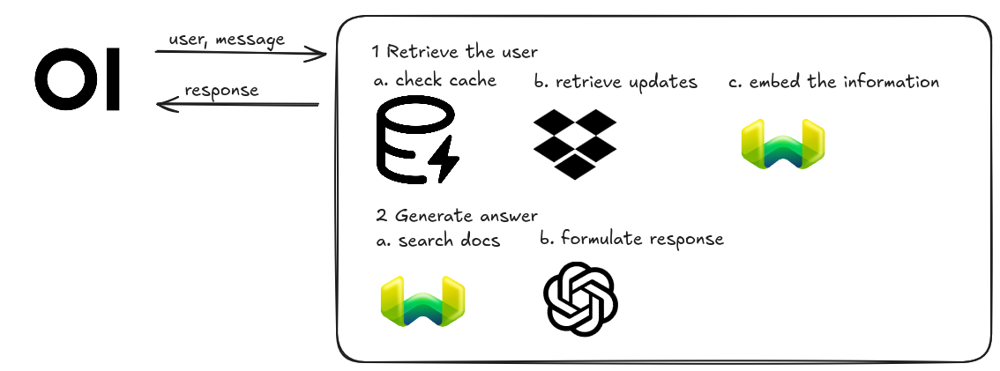

# ARMMS Chatbot

> [!TIP]
> If you already have an Open-WebUI instance running

Chatbot, that downloads, embeds and queries documents from your organization

## 🔧 How It Works

<p align="center">
  <a href="./docs/images/workflow.png"></a>
</p>

The Chatbot works by getting user queries from the Open-WebUI frontend, downloading the latest documents from your storage engine, embedding them into Weaviate to find relevant answers and using a generator model (here OpenAI) to formulate a response!

## 📂 Directory Structure

The `/src` directory includes two folders: `open-webui` and `webui_pipeline`. `open-webui` is the interface with which you can communicate with the chatbot. The actual chatbot is implemented as an Open-WebUI pipeline and can be found `ẁebui_pipeline`

> [!NOTE]
> 
> open-webui is included as a git submodule. On information regarding how to clone and download it, see the next section

## ⚡ Install & Run

For a streamlined setup using Docker:

1. **Clone the repository**
  
  ```shell
  git clone --recurse-submodules git@github.com:SoftwareEngineering-WS2025-ARMMS/chatbot.git
  ```
  
2. **Configure environment variables
  
  In order to properly connect with the other's platform components you need to configure Open-WebUI and the Chatbot correctly. Follow the following steps
  
  In `./compose-openwebui` provide information regarding your where you want to host Open-WebUI, its secret and the connections Keycloak. The variables that should be changed are:
  
  ```
  - WEBUI_URL=${WEBUI_URL} # Where are you hosting Open-WebUI
  - WEBUI_SECRET_KEY=${WEBUI_SECRET_KEY} # Configure a secret
  - OAUTH_CLIENT_ID=${OAUTH_CLIENT_ID} # Keycloak Client ID
  - OAUTH_CLIENT_SECRET=${OAUTH_CLIENT_SECRET} # Keycloak Client secret
  - OPENID_PROVIDER_URL=${OPENID_PROVIDER_URL} # Keycloak Provider URL
  ```
  
  Now configure the Chatbot. Create the file `./src/webui_pipeline/pipelines/.env` and configure the following variables
  
  ```
  OPENAI_KEY=<OPENAI_KEY>
  STORAGE_SERVER=<STORAGE_SERVER>
  ARMMS_SECRET=<ARMMS_SECRET>
  WEAVIATE_PORT=<WEAVIATE_PORT>
  CACHE_EXPIRY_SECONDS=<CACHE_EXPIRY_SECONDS> 
  ```
  
  - OPENAI_KEY is your API key provided by OpenAI
    
  - STORAGE_SERVER is where you are hosting file-dashboard-be
    
  - ARMMS_SECRET is an organisation secret used for signing JWT tokens. It should have the same value as the one provided to your Storage Engine
    
  - WEAVIATE_PORT is where you are hosting weaviate locally. Default is 8989.
    
  - CACHE_EXPIRY_SECONDS is the duration for which a document is maximally held in the cache, in seconds.
    
  
  > [!NOTE]
  > 
  > If you wish to reconfigure these variables after you deployed your application, you can do that directly from the Open-WebUI interface. See step 5 for more information
  
  Open-WebUI:
  
  ```sh
  docker run -d -p 9099:9099 --add-host=host.docker.internal:host-gateway -v pipelines:/app/pipelines --name pipelines --restart always ghcr.io/open-webui/pipelines:main
  ```
  
  ```sh
  docker run -d -p 9099:9099 --add-host=host.docker.internal:host-gateway -v pipelines:/app/pipelines --name pipelines --restart always ghcr.io/open-webui/pipelines:main
  ```
  
3. **Deploy containers:**
  
  Run the following commands to deploy Weaviate, Open-WebUI and our Pipeline, respectively
  
  Weaviate:
  
  ```shell
  docker compose -f compose-weaviate.yaml up -d
  ```
  
  Open-WebUI:
  
  ```shell
  docker compose -f compose-openwebui.yaml up -d
  ```
  
  Pipeline:
  
  ```shell
  docker build -t armms-pipeline ./src/webui_pipeline &&
  docker run -d--name armms-pipeline --network=host armms-pipeline
  ```
  
4. **Add the pipeline to Open-WebUI:**
  
  If you w
  
  - Set the API URL to `http://host.docker.internal:9099` and the API key to `0p3n-w3bu!`. Your pipelines should now be active.

5. **Manage Configurations:**
  
  - In the admin panel, go to **Admin Settings > Pipelines tab**.
    
  - Select your desired pipeline and modify the valve values directly from the WebUI.
    

That's it! You're now ready to chat with your Documents AI. Enjoy!
